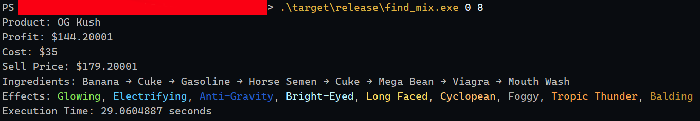

# Find Mix

**Find Mix** is a brute force tool designed to calculate the best combination of ingredients to maximize profit for various products. 

**🚧 Work in process!**

## Performance Features

- Threading (with rayon)
- Allocating (with mimalloc)
- Some general optimizations like reduced use of clone etc.

## Example

$ find_mix 0 8

Product: OG Kush \
Profit: \$144.20001 \
Cost: \$35 \
Sell Price: \$179.20001 \
Ingredients: Banana → Cuke → Gasoline → Horse Semen → Cuke → Mega Bean → Viagra → Mouth Wash \
Effects: Glowing, Electrifying, Anti-Gravity, Bright-Eyed, Long Faced, Cyclopean, Foggy, Tropic Thunder, Balding \
Execution Time: 29.0604887 seconds

## Todos

- Add reverse calculator
- Make it so ingredients can be disabled
- Add rounding and fix floating point issues (only use int?)

## Products

| ID | Product Name     | Base Value | Bse Effect                                               |
|----|------------------|------------|----------------------------------------------------------|
| 0  | OG Kush          | $35        | Calming     |
| 1  | Sour Diesel      | $35        | Refreshing |
| 2  | Green Crack      | $35        | Energizing |
| 3  | Grandaddy Purple | $35        | Sedating    |
| 4  | Meth             | $70        | None                                                     |
| 5  | Coke             | $150       | None                                                     |

# Ingredients

$\text{Cost}=\sum\text{Ingredient Prices}$

| Ingredient   | Price |
|--------------|-------|
| Cuke         | $2    |
| Banana       | $2    |
| Paracetamol  | $3    |
| Donut        | $3    |
| Viagra       | $4    |
| Mouth Wash   | $4    |
| Flu Medicine | $5    |
| Gasoline     | $5    |
| Energy Drink | $6    |
| Motor Oil    | $6    |
| Mega Bean    | $7    |
| Chili        | $7    |
| Battery      | $8    |
| Iodine       | $8    |
| Addy         | $9    |
| Horse Semen  | $9    |

## Effects

$\text{Sell Price}=\min(\max(\text{Base Value}\times(1+\sum\text{Effect Multipliers}),1),999)$ \
$\text{Profit}=\text{Sell Price}-\text{Cost}$

| Effect                                                          | Multiplier |
|-----------------------------------------------------------------|------------|
| Shrinking         | 0.60       |
| Zombifying         | 0.58       |
| Cyclopean         | 0.56       |
| Anti-Gravity        | 0.54       |
| Long Faced         | 0.52       |
| Electrifying       | 0.50       |
| Glowing            | 0.48       |
| Tropic Thunder     | 0.46       |
| Thought-Provoking | 0.44       |
| Jennerising       | 0.42       |
| Bright-Eyed       | 0.40       |
| Spicy              | 0.38       |
| Foggy             | 0.36       |
| Slippery          | 0.34       |
| Athletic          | 0.32       |
| Balding            | 0.30       |
| Calorie-Dense     | 0.28       |
| Sedating           | 0.26       |
| Sneaky            | 0.24       |
| Energizing        | 0.22       |
| Gingeritis         | 0.20       |
| Euphoric          | 0.18       |
| Focused           | 0.16       |
| Refreshing        | 0.14       |
| Munchies           | 0.12       |
| Calming            | 0.10       |
| Disorienting       | 0.00       |
| Explosive           | 0.00       |
| Laxative            | 0.00       |
| Paranoia           | 0.00       |
| Schizophrenic      | 0.00       |
| Seizure-Inducing   | 0.00       |
| Smelly             | 0.00       |
| Toxic               | 0.00       |

## Effects Additives

$\text{Additives}=\min(\max(\sum\text{Effect Additives}+0.05\cdot\mathbb{1}_{\sum\text{Ingredients}>0},0),1)$ \
When Displayed: $\text{floor}\lfloor\text{Additives}*100\rfloor$

| Effect                                                          | Additives |
|-----------------------------------------------------------------|-----------|
| Tropic Thunder     | 0.803     |
| Spicy              | 0.665     |
| Anti-Gravity        | 0.611     |
| Athletic          | 0.607     |
| Long Faced         | 0.607     |
| Zombifying         | 0.598     |
| Glowing            | 0.472     |
| Thought-Provoking | 0.370     |
| Jennerising       | 0.343     |
| Energizing        | 0.340     |
| Shrinking         | 0.336     |
| Sneaky            | 0.327     |
| Slippery          | 0.309     |
| Euphoric          | 0.235     |
| Electrifying       | 0.235     |
| Bright-Eyed       | 0.200     |
| Focused           | 0.104     |
| Refreshing        | 0.104     |
| Calorie-Dense     | 0.100     |
| Cyclopean         | 0.100     |
| Foggy             | 0.100     |
| Laxative            | 0.100     |
| Munchies           | 0.096     |
| Gingeritis         | 0.000     |
| Sedating           | 0.000     |
| Balding            | 0.000     |
| Calming            | 0.000     |
| Disorienting       | 0.000     |
| Explosive           | 0.000     |
| Paranoia           | 0.000     |
| Schizophrenic      | 0.000     |
| Seizure-Inducing   | 0.000     |
| Smelly             | 0.000     |
| Toxic               | 0.000     |
